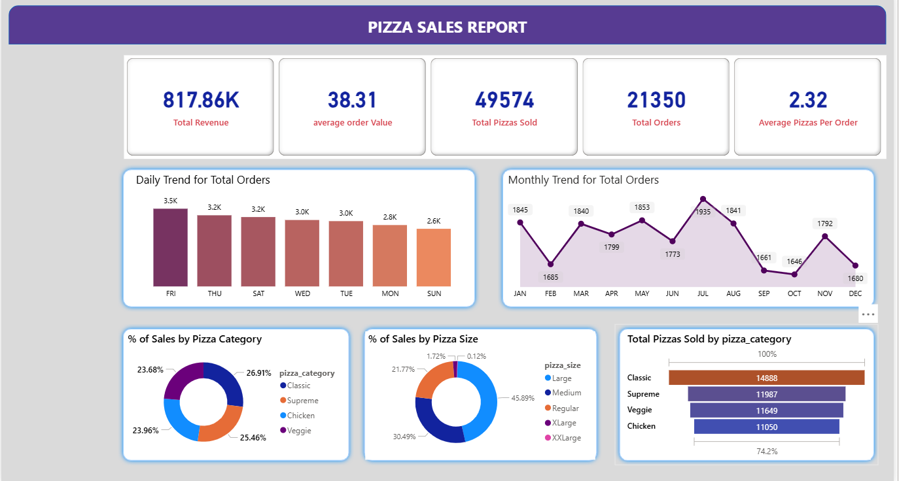

# PizzaSales-Dashboard
Data Analysis Project
# Sales Performance Dashboard (Power BI + SQL)
# Overview

This project aims to analyse and visualise sales performance data from a public dataset of a pizza's sales, using SQL for data cleaning and Power BI for visualisations and interactive dashboard reporting.

The goal was to demonstrate end-to-end data analytics skills including:
- Data cleaning using SQL
- Exploratory SQL analysis
- Visual storytelling with Power BI
- DAX powered interactive elements

# Project Objective

To analyse sales data from a pizza store and build an insightful dashboard that highlights key business performance indicators such as:
- *Revenue trends* across time
- *Top-selling Pizza* on categories
- *Average Pizzas per Order*
- Daily Trend for Total Orders
- Monthly Trends for Total Orders
- Percentage of Sales by Pizza Categories
- Dynamic filters and *drill-down analysis*

# Data Cleaning & Exploration (SQL)

Performed in *SQL* 

The original dataset was cleaned using SQL:
- *Standardizing column names*
- *Fixing data types* 
- *Removing duplicate rows* with inconsistent pricing
- *Filling missing values* 
- *Normalizing decimal places* for monetary values
- *Creating exploratory queries*:
  - Top items by revenue
  - Sales by category, Quantity
  - Monthly/yearly sales trends
  - Category performance over time

All SQL queries are included here: [SQL Analysis](./pizza_sales_analysis.sql) 

# Dashboard Features (Power BI)

The dashboard was created using *Power BI Desktop* and includes:

- *Dynamic titles* that update based on slicers and drilldowns
- *Tooltip pages* for extra insight without clutter
- *Top-row slicers* for intuitive filtering by year, category
- *Drill-down charts* for monthly and category trends
- Clean layout grouped by:
  - *Overview KPIs*
  - *Performance by category*
  - *Time-based trends*

Dashboard preview included here: 

# How to Use

1. Clone or download this project folder.
2. Open the `.pbix` file in Power BI Desktop.
3. Adjust filters to explore the dashboard.
4. Review `pizza_sales_analysis.sql` for all SQL queries used.

---

# Files Included

- [SQL Analysis](./pizza_sales_analysis.sql)
- [Power BI Dashboard (PBIX)](./pizza_sales_dashboard.pbix)
- [Dashboard Preview Image](./pizza_sales_dashboard_preview.png)
- [Raw Dataset (CSV)](./pizza_sales.csv)

# Tech Stack

- SQL (SQL for cleaning)
- Power BI (Dashboard creation, DAX for dynamic elements)
- VS Code (README documentation)# sales-performance-dashboard
